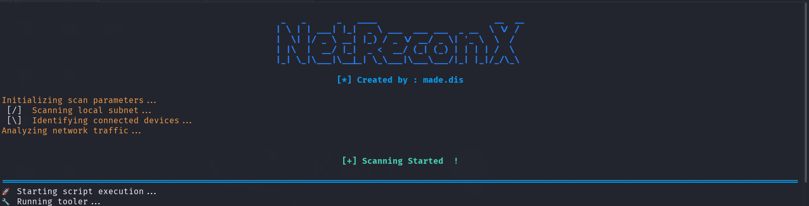

# NetReconX - Network Reconnaissance Tool



NetReconX is a powerful network reconnaissance and security assessment tool written in Bash. It provides a comprehensive suite of tools for network scanning, service enumeration, vulnerability assessment, and security testing.

## Features

- 🎯 Multi-stage network scanning
- 🔍 Service enumeration and version detection
- 🛡️ Vulnerability assessment
- 📊 Automated tool execution based on discovered services
- 📝 Detailed logging and reporting
- 🎨 Colorful terminal interface
- 🔄 Modular and extensible architecture
- 🛠️ Easy tool integration
- ⚙️ Configurable scanning stages

## Prerequisites

- Bash shell
- Common security tools (see Dependencies section)
- Root/sudo privileges (for certain operations)
## Dependencies

NetReconX relies on several security tools for its functionality. Here's a comprehensive list of required tools:

### Core Dependencies
- `nmap` - Network scanning and service detection
- `curl` - HTTP requests and data transfer
- `grep` - Text pattern matching
- `awk` - Text processing
- `sed` - Stream editor
- `tput` - Terminal control

### Security Tools
- `hydra` - Password cracking and brute force
- `sqlmap` - SQL injection testing
- `wpscan` - WordPress vulnerability scanning
- `nikto` - Web server scanning
- `whatweb` - Web technology detection
- `gobuster` - Directory/file brute forcing
- `ffuf` - Web fuzzing
- `enum4linux` - SMB enumeration
- `smbclient` - SMB client
- `redis-cli` - Redis client
- `mysql` - MySQL client
- `psql` - PostgreSQL client
- `dig` - DNS lookup utility
- `nslookup` - DNS query tool
- `ldapsearch` - LDAP search utility
- `kerbrute` - Kerberos brute force tool
- `crackmapexec` - Active Directory assessment
- `evil-winrm` - WinRM client
- `mssql-scriptor` - MSSQL client
- `sqlcmd` - SQL Server command-line tool
- `dns-recon` - DNS enumeration
- `snmp-check` - SNMP enumeration
- `rdp-sec-check` - RDP security check
- `xfreerdp` - RDP client
- `vncviewer` - VNC client
- `flask-scan` - Flask application scanner
- `xeyes` - X11 test tool
- `xclock` - X11 clock
- `x11-brute` - X11 brute force tool
- `medusa` - Parallel login cracker
- `john` - Password cracker
- `smtp-user-enum` - SMTP user enumeration
- `rpcinfo` - RPC information tool
- `odat.py` - Oracle database assessment
- `redis-exploit.py` - Redis exploitation tool

### Optional Dependencies
- `metasploit` - Exploitation framework
- `bloodhound` - Active Directory analysis
- `ligolo-ng` - Tunneling tool
- `nbtscan` - NetBIOS scanner
- `imapscan` - IMAP scanner
- `pop3scan` - POP3 scanner
- `syslog-scanner` - Syslog scanner
- `mongod-enum` - MongoDB enumeration
- `dhcping` - DHCP ping tool
- `dnsmasq` - DNS server
- `ripv2-scanner` - RIP v2 scanner

### Installation
To install all dependencies on Debian/Ubuntu:
```bash
sudo apt-get update
sudo apt-get install nmap hydra sqlmap wpscan nikto whatweb gobuster ffuf \
    enum4linux smbclient redis-cli mysql-client postgresql-client dnsutils \
    ldap-utils kerbrute crackmapexec evil-winrm mssql-scriptor sqlcmd \
    dnsrecon snmp-check rdp-sec-check freerdp2-x11 vncviewer \
    medusa john smtp-user-enum rpcbind odat redis-tools
```

For tools not available in package managers, you'll need to:
1. Download them from their respective repositories
2. Install them manually
3. Ensure they're in your system PATH

## Installation of NetReconX

1. Clone the repository:
```bash
git clone https://github.com/yourusername/NetReconX.git
cd NetReconX
```

2. Make the script executable:
```bash
chmod +x main.sh
```

3. Install dependencies:
```bash
sudo apt-get update
sudo apt-get install nmap hydra sqlmap wpscan nikto whatweb gobuster ffuf
```

## Configuration

### IP Address and DNS Configuration

Currently, you need to manually set the IP address and DNS server in the script. Edit the `execute_tools` function in `main.sh`:

```bash
execute_tools() {
    # Set your target IP address
    ip_address="10.10.11.63"  # Change this to your target IP
    dns_server="whiterabbit.htb"  # Change this to your target domain
    ...
}
```

⚠️ **Note**: In future versions, this will be made dynamic through command-line arguments or configuration files.

### Adding New Tools

To add a new tool to NetReconX:

1. Add the tool to the `DEPLOYED_TOOL_AGENT` array in `main.sh`:
```bash
declare -gA DEPLOYED_TOOL_AGENT=(
    ["your_tool"]="TOOL_ID"
    ...
)
```

2. Add the tool's service mapping to the `DEMARCHE` array:
```bash
DEMARCHE=(
    ["service_name"]="your_tool,other_tools"
    ...
)
```

3. Create a new case in the `execute_tools` function:
```bash
case "$tool" in
    your_tool)
        echo "Running Your Tool..."
        # Add your tool's execution logic here
        ;;
    ...
esac
```

### Adding New Stages

To add a new scanning stage:

1. Create a new stage array in `main.sh`:
```bash
STAGE_X=(
    ["option1"]="${SOME_OPTION}"
    ["option2"]="${ANOTHER_OPTION}"
)
```

2. Add the stage to the case statement in the `tooler` function:
```bash
case $stage in
    X)
        log "Starting Stage X scan."
        for option_group in "${!STAGE_X[@]}"; do
            option="${STAGE_X[$option_group]}"
            scan_options+="$option "
        done
        ;;
    ...
esac
```

## Usage

Basic usage:
```bash
./main.sh <stage> <target>
```

### Parameters:
- `stage`: The scanning stage (0-3)
- `target`: Target IP address or hostname

### Example:
```bash
./main.sh 0 192.168.1.1
```

## Scanning Stages

### Stage 0: Initial Discovery
- Host discovery
- Basic port scanning
- Service detection

### Stage 1: Service Enumeration
- Detailed service version detection
- OS fingerprinting
- Script scanning

### Stage 2: Vulnerability Assessment
- CVE detection
- Vulnerability scanning
- Security misconfiguration checks

### Stage 3: Advanced Testing
- Brute force testing
- Exploit verification
- Advanced vulnerability assessment

## Tool Integration Guide

### Step 1: Tool Registration
1. Add your tool to `DEPLOYED_TOOL_AGENT` with a unique ID
2. Map the tool to relevant services in `DEMARCHE`
3. Add the tool's execution logic in `execute_tools`

### Step 2: Service Mapping
1. Identify which services your tool can test
2. Add the service to `DEMARCHE` if it doesn't exist
3. Add your tool to the service's tool list

### Step 3: Execution Logic
1. Create a case for your tool in `execute_tools`
2. Add error handling and logging
3. Implement output redirection to the output directory

Example tool integration:
```bash
# Step 1: Register tool
DEPLOYED_TOOL_AGENT["new_tool"]="NT001"

# Step 2: Map to service
DEMARCHE["http"]="new_tool,existing_tools"

# Step 3: Add execution logic
case "$tool" in
    new_tool)
        echo "Running New Tool..."
        output_file="$OUTPUT_DIR/new_tool_output.txt"
        new_tool "$ip_address" >> "$output_file"
        ;;
esac
```

## Output

Results are saved in the following directories:
- `./output_dir/`: Main output directory
- `./dumped_html/`: HTML content dumps
- Log files with timestamps

## Contributing

1. Fork the repository
2. Create your feature branch (`git checkout -b feature/AmazingFeature`)
3. Commit your changes (`git commit -m 'Add some AmazingFeature'`)
4. Push to the branch (`git push origin feature/AmazingFeature`)
5. Open a Pull Request

## Security Considerations

⚠️ **IMPORTANT**: This tool is for authorized security testing only. Always:
- Obtain proper authorization before scanning
- Respect rate limits
- Follow applicable laws and regulations
- Use responsibly and ethically

## Acknowledgments

- Inspired by various security tools and frameworks
- Thanks to the open-source security community

## Roadmap

- [ ] Dynamic IP/DNS configuration
- [ ] Web interface
- [ ] API integration
- [ ] More tool integrations
- [ ] Automated reporting


## Disclaimer

This tool is provided for educational and authorized security testing purposes only. The authors are not responsible for any misuse or damage caused by this program. 
